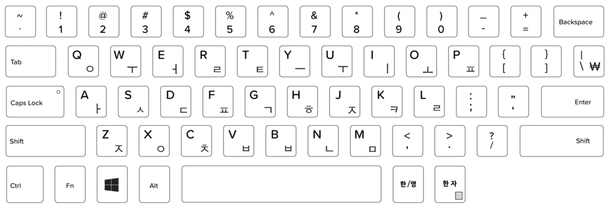
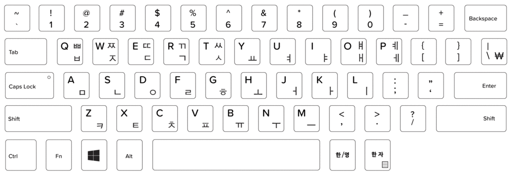

# Rime 韩语输入方案

就像我在[文章](https://blog.einverne.info/post/2019/08/rime-korean-japanese-input-method.html) 中总结的那样，目前标准的韩语键盘布局，应该是 2-set 布局。

熟悉了这个键盘布局基本上就能够输入任何韩文了。但是假如你是韩语初学者，或者习惯韩语罗马字方案，那么额外背诵一套键盘布局可能并不是你的最佳选择。所以这个 repo 中也有 Rime 中实现罗马字转写的方案。

本 repo 包含三个韩文 RIME 方案：

- rime-hangyl
- hangeul-2-set
- hangeul-structure

## rime-hangyl
Rime 音码转写方案，repo 中有图片指导，来源于 Rime 官方 repo.

在键盘上的布局如下：

会发现有些发音是会对应两个键的。

例子：

## hangeul-2-set
韩语标准键盘布局，具体可见下文地址。该方案由 [洋葱](http://deltazone.pixnet.net/blog/post/264243364) 提供。

## hangeul-structure
韩语形码，由[洋葱](http://deltazone.pixnet.net/blog/post/264243364) 制作，具体的形码编码方案可以见[洋葱的博客](http://deltazone.pixnet.net/blog/post/264243364).

## use in rime

	# default.custom.yaml
	# save it to:
	#   ~/.config/ibus/rime  (linux)
	#   ~/.config/fcitx/rime  (linux)
	#   ~/Library/Rime       (macos)
	#   %APPDATA%\Rime       (windows)

	patch:
	  schema_list:
	    - schema: hangyl
	    - schema: hangeul
	    - schema: hangeul2set

## 更改记录

- 同步洋葱[博客 20190826 更新](http://deltazone.pixnet.net/blog/post/341170670)

## reference

详细内容可参考[我之前写的文章](https://blog.einverne.info/post/2019/08/rime-korean-japanese-input-method.html)
